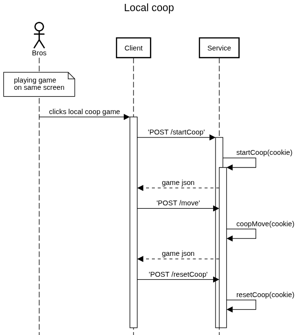

# Go (wéiqí)

A game I really love but haven't played much. I thought this would be a fun way to try out using python as a backend.

The rules for play can be found here: 

## Development

The frontend folder is a React website. The pages can be found in components. The service folder is the backend, `app.py` lists the api calls and server logic. Database code is in the `/db` directory, and different game object types are in the `/games` directory.

To run, open two terminals and navigate one to `/service` and `/frontend`.
1. Run `chmod +x setup.sh` and `source setup.sh`. This should activate a venv python environment. Then run `python3 app.py`.
2. Run `npm i` to install dependencies in frontend. `npm run dev` will host the frontpage with vite, and vite will redirect the api calls to the backend process running on localhost:5000.

## Architecture

### Sequences

#### Local coop

#### Local Network

TODO

#### Online Network

TODO

### Class diagrams

TODO
